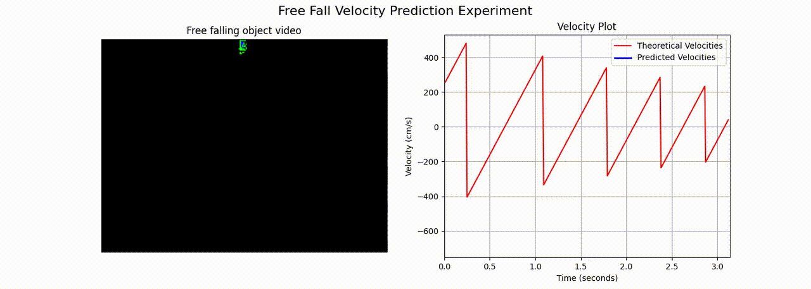

# Free Fall Velocity Prediction Experiment
This project aims to predict the velocity of a free-falling object recorded using an event-based camera data. The experiment involves determining the object coordinates, predicting the its velocity, and comparing it with the theoretical velocity.

<div align="center">
  
</div>

## Usage
1. Install the required packages:
    ```sh
    pip install -r requirements.txt
    ```

2. Run the Jupyter notebook.